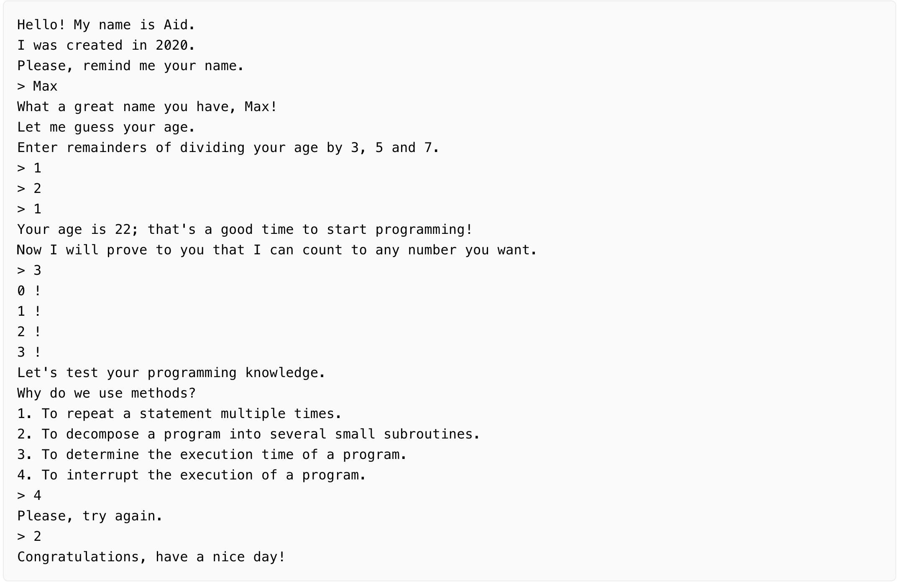

# Multiple choice

## Description
At the final stage, you will improve your simple bot so that it can give you a test and check your answers. The test should be a multiple-choice quiz about programming. Your bot has to repeat the test until you answer correctly and congratulate you upon completion.

## Objective
Your bot can ask anything you want, but there are two rules for your output:

- the line with the test should end with the question mark character;
- an option starts with a digit followed by the dot (1., 2., 3., 4.)
If a user enters an incorrect answer, the bot may print a message:

Please, try again.
The program should stop on the correct answer and print Congratulations, have a nice day! at the end.

## Example
The greater-than symbol followed by a space (> ) represents the user input. Note that it's not part of the input.

Example 1: a dialogue with the final version of your bot  

The program must end with the Congratulations, have a nice day! message.

Use the provided template to simplify your work. You can change the text if you want. Please note that we use functions to make it easy to understand the program and add new code to it or edit later.

